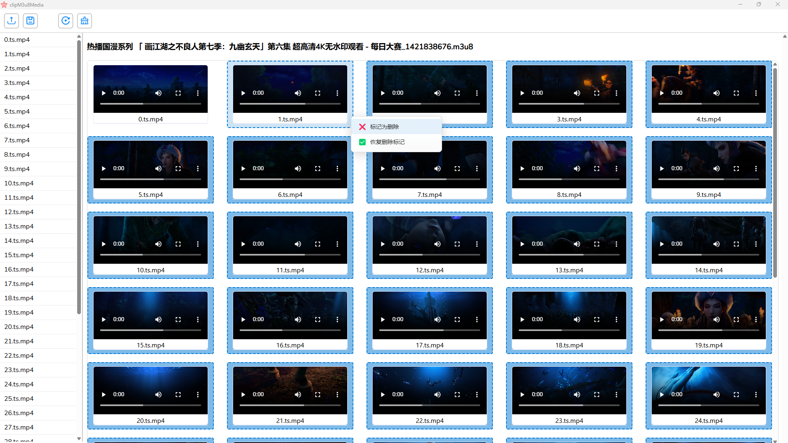
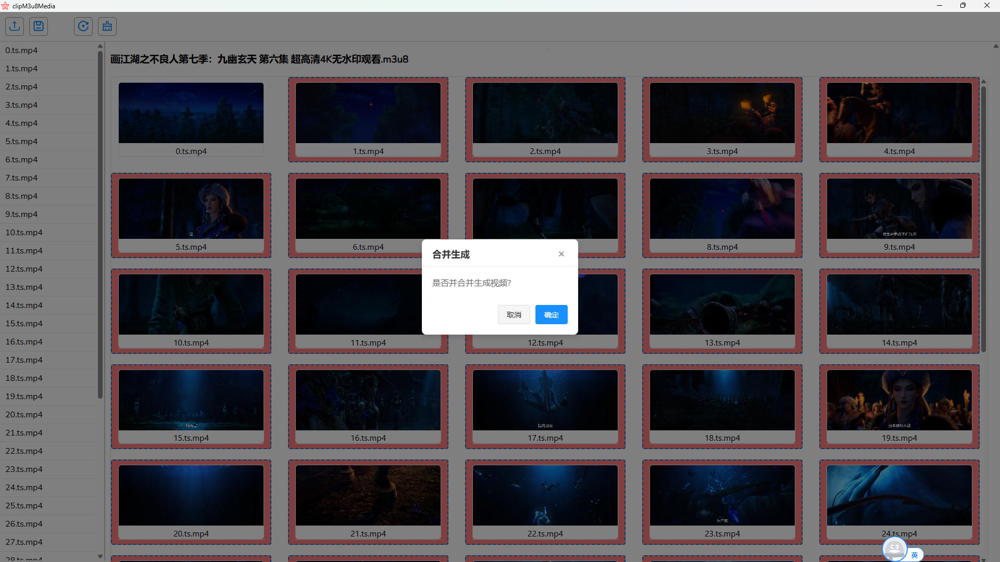
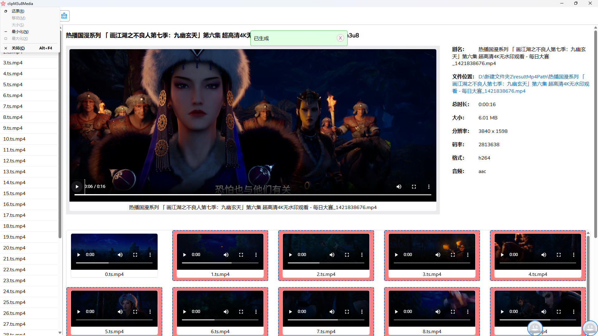

中文 | [English](./README.md)
# 自述文件

## 关于应用
这是一个本地 m3u8 媒体剪辑器。

## 关于 Wails

这是官方的 Wails Vue-TS 模板。

你可以通过编辑 `wails.json` 来配置项目。关于项目设置的更多信息可以在这里找到：https://wails.io/docs/reference/project-config

## 实时开发

要在实时开发模式下运行，请在项目目录下运行 `wails dev`。这将运行一个 Vite 开发服务器，为你的前端更改提供非常快速的热重载。如果你想在浏览器中开发并访问你的 Go 方法，也有一个开发服务器运行在 http://localhost:34115。在浏览器中连接它，你就可以从开发者工具中调用你的 Go 代码。

## 构建

要构建可分发的生产模式包，请使用 `wails build`。

## 预览图

